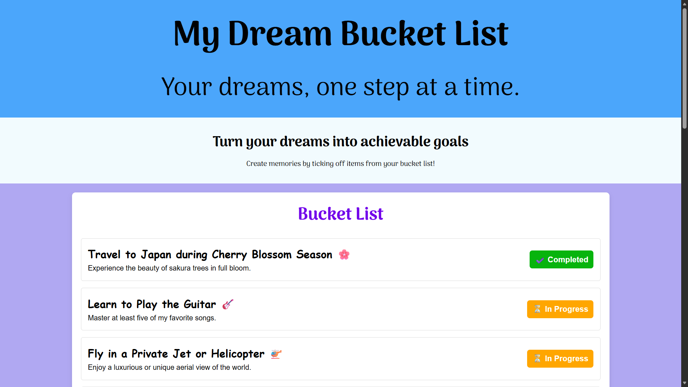

# 🌟 Dream Bucket List 🌟

A visually engaging webpage that showcases my personal goals, learning ambitions, travel dreams, and life milestones.  
Built using **HTML** and **CSS**, this project is a fun way to practice lists, icons, layout design, and custom styling.

---

## 🖼️ Project Preview



---

## 🧠 Overview
The **Dream Bucket List** project represents my personal aspirations and serves as a creative HTML-CSS exercise to strengthen front-end design skills.  
It includes well-structured lists, decorative icons, and a responsive, colorful layout.

---

## ⚙️ Tech Stack
- **HTML5** – Structure  
- **CSS3** – Styling and layout  

---

## ✨ Features
- Themed and colorful bucket list layout  
- Use of icons and symbols for each goal  
- Responsive design  
- Simple, semantic HTML  

---

## 🚀 How to Run
1. Clone the repository:
   ```bash
   git clone https://github.com/yourusername/Dream-Bucket-List.git
